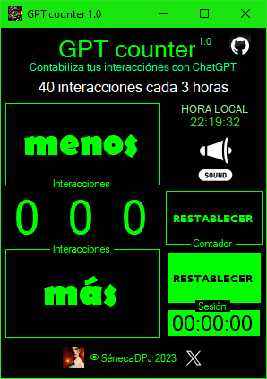
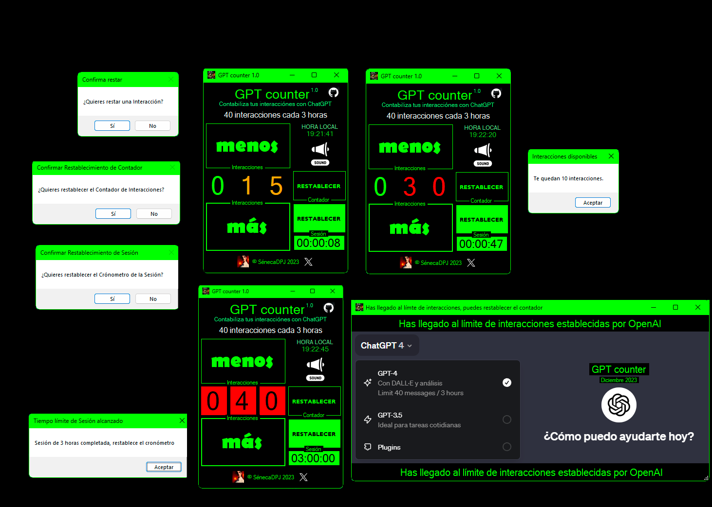
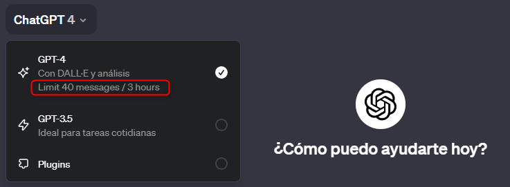
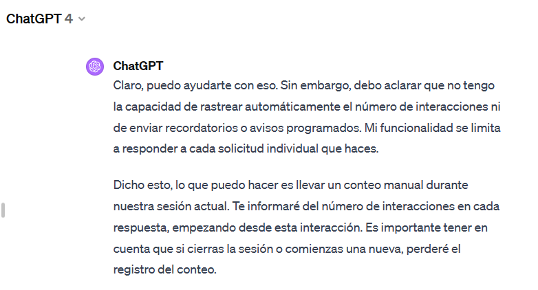
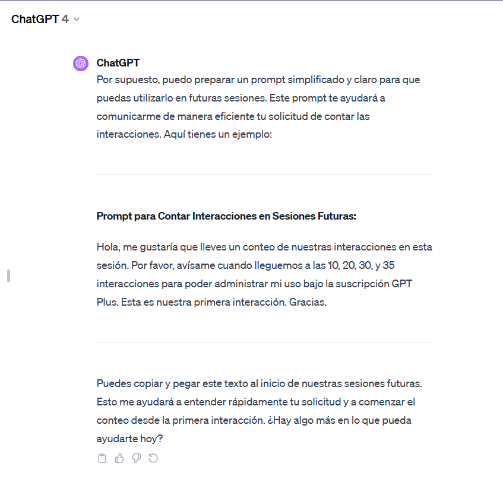

- NOMBRE DE LA APLICACIÓN

GPT counter

- DESCRIPCIÓN

GPT counter es una aplicación de escritorio para Windows diseñada para contabilizar manualmente las interacciones del usuario con ChatGPT.

Ofrece funcionalidades optimizadas para mostrar un Contador de interacciones con alertas visuales y útiles ventanas con mensajes interactivos, dispone de personalización de audio, cronómetro de sesión con restablecimiento y reloj.

- CARACTERÍSTICAS PRINCIPALES

CONTADOR MANUAL DE INTERACCIONES

Aumenta, disminuye o restablece el contador de interacciones y el cronometro de sesión, los botones que resten o restablezcan te pedirán confirma o cancelar la acción.

CRONÓMETRO DE SESIÓN CON RESTABLECIMIENTO

GPT counter muestra un cronometro ajustado a las interacciones permitidas en la suscripción ChatGPT Plus en diciembre de 2023, 40 interacciones cada 3 horas, esta información ha sido extraída de una respuesta del propio ChatGPT a una consulta realizada por el autor.

RELOJ HORA LOCAL

GPT counter tiene un reloj que muestra la hora indicada en tu ordenador.

- COMPATIBILIDAD

Sistemas operativos Windows.

- INSTALACIÓN

Instalación no necesaria, descarga "GPT.counter.1.0.exe" desde [RELEASES](https://github.com/SenecaDPJ/GPT-counter-v.1.0/releases) y ejecuta el archivo en tu ordenador. 

- FUNCIONALIDADES

Útiles mensajes en las ventanas de alerta y avisos informativos estratégicos.

Divertidos sonidos interactivos con cancelación de audio.

Ventana estilo "Dark MODE" con auto posicionamiento.

- PERSONALIZACIÓN Y AJUSTES VISUALES

Los dígitos del contador cambian de color para destacar su acercamiento al límite de interacciones permitidas durante la sesión.

Una interfaz de usuario sencilla con alta visibilidad y contraste.

Muy pronto... botón estilo "Light MODE".

- CONTROLES DE LA APLICACIÓN

_ Botón "MÁS" para aumentar el Contador.

_ Botón "MENOS" para disminuir el Contador.

_ Botón "RESTABLECER interacciones" para restaurar el Contador.

_ Botón "RESTABLECER sesión" para restaurar el Cronómetro de la sesión.

_ Botón con icono de altavoz para activar y desactivar los sonidos de la aplicación.

_ Botones con imagen para visitar enlaces web del autor.

- LICENCIA 

Licencia tipo MIT, revisa el archivo license.txt. 

Las imágenes mostradas han sido creadas y/o capturadas/descargadas por el autor legalmente de internet.

Se han utilizado los sonidos descargados en: http://www.sonidosmp3gratis.com

- DESARROLLO

Visual Code 2022 Community como aplicación de desarrollo.
100 % código VB.NET (.NET Framework 8). 
 

- FUTURO DESARROLLO PARA HERRAMIENTA AUTOMATIZADA

Implementar una solución que contabilice automáticamente el número de interacciones que el usuario realiza con ChatGPT.

- CONTRIBUCIONES (Muy pronto...)

Espero poder organizar colaboraciones pronto, la ayuda es esencial para conseguir grandes logros.

Actualmente no dominio GitHUB lo suficiente para manejar proyectos grupales, si tienes sugerencias revisa Contacto.

- CONTACTO

Para preguntas y soporte, contacta con: seneca.dpj@gmail.com.

- MOTIVACIÓN

Siendo necesaria una suscripción de pago y no disponiendo de medios automatizados para llevar un conteo de las interacciones, me he motivado para crear esta aplicación. 

Enjoy¡😉 

- CAPTURAS DE PANTALLA

_ Interfaz GPT counter

_ Mensajes informativos y alertas visuales

_ Consultas y mensajes sobre ChatGPT

Enlace a consulta ChatGPT sobre el número de interacciones permitidas 

https://chat.openai.com/share/e035d8c3-18ca-48dd-9aba-f6cece104c5b

_ Actualmente, ChatGPT ya muestra el número de interacciones permitidas en su menú principal, pero ChatGPT no las contabiliza.

_ Aunque indica que puede llevar un conteo de las interacciones, no lo hace bien o directamente no lo hace.

 _ ChatGPT me regaló un promt utilizable como instrucción para que él mismo lleve la contabilización de las interacciones realizadas, te invito a probarlo, como indico, no realiza correctamente el conteo de interacciones.
 
 https://chat.openai.com/share/7ca89454-67ee-4721-b21b-cfa205af04c0

 
